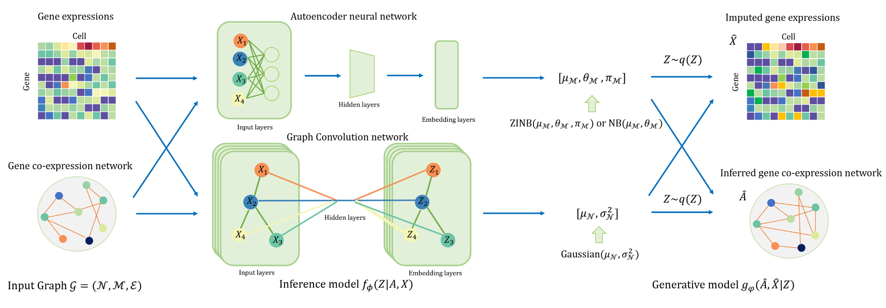
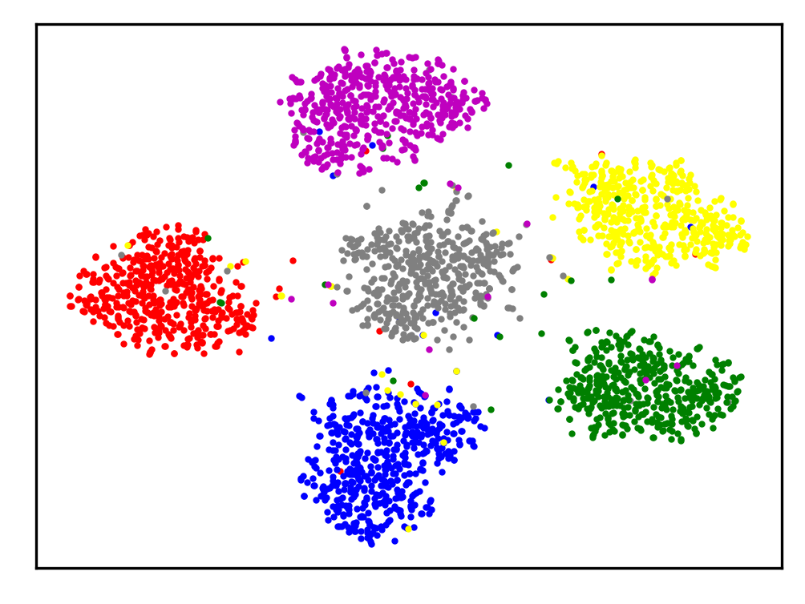

## Imputing Single-cell RNA-seq data by combining Graph Convolution and Autoencoder Neural Networks
This repository contains the Python implementation for GraphSCI. Further details about GraphSCI can be found in our paper:
> Jiahua Rao, Xiang Zhou, Yutong Lu, Huiying Zhao, Yuedong Yang. Imputing Single-cell RNA-seq data by combining Graph Convolution and Autoencoder Neural Networks


## Requirements

=================
* TensorFlow (1.0 or later)
* python 3.6
* scikit-learn
* scipy
* scanpy

## Overview


## Tutorial
See our [manuscript](https://www.biorxiv.org/content/10.1101/2020.02.05.935296v1) and [tutorial]() for more details.
=================
### Preprocess

Preprocess the gene expression matrix and construct the input of gene-to-gene relationships

### Training 
```bash
python train.py --adata ./splatter_data/counts_simulated_dataset3_3000x3000_dropout0.30.h5ad --adj  --learning_rate 1e-3 --epochs 100 --hidden1 32 --hidden2 64 --batch_size 50 --dropout 0.1
```

### Evaluation

#### clustering performance


#### Differential expression analysis


## Run the demo
=================

```bash
python train.py
```

## Citation

If you want to use our codes and datasets in your research, please cite our paper:
```
@article{rao2020imputing,
  title={Imputing single-cell RNA-seq data by combining graph convolution and autoencoder neural networks},
  author={Rao, Jiahua and Zhou, Xiang and Lu, Yutong and Zhao, Huiying and Yang, Yuedong},
  journal={biorxiv},
  year={2020},
  publisher={Cold Spring Harbor Laboratory}
}
```
